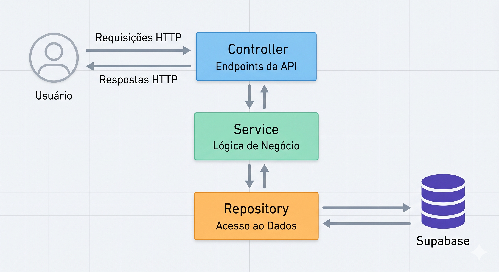

# 🛒 API Marketplace de Produtos
 
Uma API FastAPI moderna e robusta para gerenciamento de **produtos, categorias, fornecedores e endereços** em um marketplace. Construída com **Supabase (PostgreSQL)** como banco de dados e **SQLModel** para validação de dados.
 
---
 
## ✨ Features
 
- ✅ **REST API completa** com CRUD de produtos, categorias, fornecedores e endereços
- ✅ **Filtros avançados**: busca, paginação, ordenação, range de preços
- ✅ **Relacionamentos**: produtos ↔ categorias, produtos ↔ fornecedores
- ✅ **Soft delete**: produtos e recursos não são permanentemente deletados
- ✅ **Validação robusta**: Pydantic + SQLModel
- ✅ **Documentação automática**: Swagger UI + ReDoc
- ✅ **Versionamento**: Suporte para múltiplas versões de API (V1, V2)
- ✅ **Logging estruturado**: Rastreamento de erros e operações
---
 
## 🛠️ Stack Tecnológico
 
| Tecnologia | Versão | Propósito |
|------------|--------|----------|
| **Python** | 3.13+ | Linguagem principal |
| **FastAPI** | 0.135.3+ | Framework web |
| **Pydantic** | 2.12.5+ | Validação de dados |
| **SQLModel** | 0.0.38+ | ORM e validação |
| **Supabase** | 2.28.3+ | Banco de dados PostgreSQL |
| **Uvicorn** | 0.43.0+ | Servidor ASGI |
| **uv** | Latest | Gerenciador de pacotes (mais rápido que pip) |
 
---
 
## 📋 Requisitos
 
- **Python 3.13+**
- **uv** (gerenciador de pacotes) - [Instalação](https://docs.astral.sh/uv/getting-started/installation/)
- **Conta Supabase** - [Criar conta](https://supabase.com)
---
 
## 🚀 Instalação
 
### 1️⃣ Clone o repositório
 
```bash
git clone https://github.com/renatonfreitas/api-marketplace-products.git
cd api-marketplace-products
```
 
### 2️⃣ Instale as dependências com `uv`
 
```bash
uv sync
```
 
### 3️⃣ Configure as variáveis de ambiente
 
Crie um arquivo `.env` na raiz do projeto:
 
```env
# Supabase
SUPABASE_URL=https://seu-projeto.supabase.co
SUPABASE_KEY=sua-api-key-publica
 
# FastAPI
DEBUG=True
LOG_LEVEL=INFO
```
 
> 💡 **Nota:** Você pode usar apenas `SUPABASE_URL` e `SUPABASE_KEY` em seu arquivo `.env`.
 
### 4️⃣ Configure o banco de dados
 
Execute o script SQL no Supabase SQL Editor:
 
```sql
-- Execute o arquivo: database/migrations/init.sql
```
 
Ou copie e execute manualmente:
 
```sql
CREATE TABLE suppliers (
    supplier_id UUID PRIMARY KEY DEFAULT uuid_generate_v4(),
    name VARCHAR(255) UNIQUE NOT NULL,
    email VARCHAR(255) UNIQUE,
    phone VARCHAR(20),
    is_active BOOLEAN DEFAULT true,
    created_at TIMESTAMP DEFAULT now(),
    updated_at TIMESTAMP DEFAULT now()
);
 
CREATE TABLE addresses (
    address_id UUID PRIMARY KEY DEFAULT uuid_generate_v4(),
    supplier_id UUID REFERENCES suppliers(supplier_id),
    street VARCHAR(255) NOT NULL,
    number VARCHAR(10),
    complement VARCHAR(255),
    neighborhood VARCHAR(100),
    city VARCHAR(100) NOT NULL,
    state CHAR(2) NOT NULL,
    zip_code VARCHAR(10),
    country VARCHAR(100) DEFAULT 'Brasil',
    is_active BOOLEAN DEFAULT true,
    created_at TIMESTAMP DEFAULT now(),
    updated_at TIMESTAMP DEFAULT now()
);
 
CREATE TABLE categories (
    category_id UUID PRIMARY KEY DEFAULT uuid_generate_v4(),
    name VARCHAR(255) UNIQUE NOT NULL,
    is_active BOOLEAN DEFAULT true,
    created_at TIMESTAMP DEFAULT now(),
    updated_at TIMESTAMP DEFAULT now()
);
 
CREATE TABLE products (
    product_id UUID PRIMARY KEY DEFAULT uuid_generate_v4(),
    sku VARCHAR(50) UNIQUE NOT NULL,
    name VARCHAR(255) NOT NULL,
    description TEXT,
    quantity_per_unit VARCHAR(50),
    unit_price DECIMAL(10, 2) NOT NULL CHECK (unit_price > 0),
    discount DECIMAL(5, 2) DEFAULT 0 CHECK (discount >= 0 AND discount <= 100),
    is_active BOOLEAN DEFAULT true,
    created_at TIMESTAMP DEFAULT now(),
    updated_at TIMESTAMP DEFAULT now()
);
 
CREATE TABLE products_categories (
    product_id UUID REFERENCES products(product_id),
    category_id UUID REFERENCES categories(category_id),
    PRIMARY KEY (product_id, category_id)
);
 
CREATE TABLE products_suppliers (
    product_id UUID REFERENCES products(product_id),
    supplier_id UUID REFERENCES suppliers(supplier_id),
    PRIMARY KEY (product_id, supplier_id)
);
```
 
---
 
## 🏃 Execução
 
### Modo desenvolvimento (com auto-reload)
 
```bash
uv run uvicorn app.main:app --reload
```
 
### Modo produção
 
```bash
uv run uvicorn app.main:app --host 0.0.0.0 --port 8000
```
 
A API estará disponível em:
- **API**: http://localhost:8000
- **Swagger UI**: http://localhost:8000/docs
- **ReDoc**: http://localhost:8000/redoc
---
 
## 📁 Estrutura do Projeto
 
```
api-marketplace-products/
├── app/
│   ├── api/
│   │   ├── v1/
│   │   │   ├── endpoints/
│   │   │   │   └── products.py
│   │   │   ├── repositories/
│   │   │   │   └── product_repository.py
│   │   │   ├── services/
│   │   │   │   └── product_service.py
│   │   │   └── schemas/
│   │   │       ├── product.py
│   │   │       └── category.py
│   │   └── v2/
│   │       ├── endpoints/
│   │       │   ├── products.py
│   │       │   ├── categories.py
│   │       │   ├── suppliers.py
│   │       │   └── addresses.py
│   │       ├── repositories/
│   │       │   ├── product_repository.py
│   │       │   ├── category_repository.py
│   │       │   ├── supplier_repository.py
│   │       │   └── address_repository.py
│   │       ├── services/
│   │       │   ├── product_service.py
│   │       │   ├── category_service.py
│   │       │   ├── supplier_service.py
│   │       │   └── address_service.py
│   │       └── schemas/
│   │           ├── product.py
│   │           ├── category.py
│   │           ├── supplier.py
│   │           └── address.py
│   ├── models/
│   │   └── product.py (SQLModel - documentação)
│   ├── assets/
│   │   └── diagrama-arquitetura.png
│   ├── core/
│   │   ├── config.py
│   │   ├── database.py
│   │   ├── exceptions.py
│   │   └── version_info.py
│   └── main.py
├── database/
│   └── migrations/
│       └── init.sql
├── .env.example
├── pyproject.toml
├── README.md
└── uv.lock
```
 
## 🏗️ Arquitetura da API  

A API usa arquitetura em **camadas** que separa responsabilidades:



---
 
## 🔌 Endpoints da API
 
### V1 (Deprecated - Será descontinuada em 2025-12-31)
 
```
GET    /api/v1/products              # Listar produtos
GET    /api/v1/products/{sku}        # Obter produto por SKU
POST   /api/v1/products              # Criar produto
PUT    /api/v1/products/{sku}        # Atualizar produto
DELETE /api/v1/products/{sku}        # Deletar produto
```
 
### V2 (Recomendado)
 
#### Produtos
 
```
GET    /api/v2/products              # Listar com filtros
GET    /api/v2/products/{sku}        # Obter por SKU
POST   /api/v2/products              # Criar
PUT    /api/v2/products/{sku}        # Atualizar
DELETE /api/v2/products/{sku}        # Deletar
```
 
#### Categorias
 
```
GET    /api/v2/categories            # Listar
GET    /api/v2/categories/{id}       # Obter por ID
POST   /api/v2/categories            # Criar
PUT    /api/v2/categories/{id}       # Atualizar
DELETE /api/v2/categories/{id}       # Deletar
```
 
#### Fornecedores
 
```
GET    /api/v2/suppliers             # Listar
GET    /api/v2/suppliers/{id}        # Obter
POST   /api/v2/suppliers             # Criar
PUT    /api/v2/suppliers/{id}        # Atualizar
DELETE /api/v2/suppliers/{id}        # Deletar
```
 
#### Endereços
 
```
GET    /api/v2/addresses             # Listar
GET    /api/v2/addresses/{id}        # Obter por ID
POST   /api/v2/addresses             # Criar
PUT    /api/v2/addresses/{id}        # Atualizar
DELETE /api/v2/addresses/{id}        # Deletar
```
 
#### Info
 
```
GET    /                             # Root - Status e versão da API
GET    /api/info                     # Info geral da API
```
 
---
 
## 📝 Exemplos de Uso
 
### Listar Produtos
 
```bash
curl -X GET "http://localhost:8000/api/v2/products?page=1&limit=10&sort=name&order=asc"
```
 
**Parâmetros:**
- `page`: Número da página (padrão: 1)
- `limit`: Itens por página (padrão: 10, máximo: 100)
- `sort`: Campo para ordenação (name, unit_price, discount, created_at)
- `order`: asc ou desc
- `search`: Busca por nome ou descrição
- `min_price`: Preço mínimo
- `max_price`: Preço máximo
- `category`: Nome da categoria
- `only_active`: Apenas produtos ativos (padrão: true)
### Criar Produto
 
```bash
curl -X POST "http://localhost:8000/api/v2/products" \
  -H "Content-Type: application/json" \
  -d '{
    "sku": "NOTEBOOK-001",
    "name": "Notebook Dell Inspiron",
    "description": "Notebook 15 polegadas",
    "unit_quantity": "1 unidade",
    "unit_price": 3500.00,
    "discount": 10.00,
    "category_ids": ["uuid-categoria-1"],
    "supplier_ids": ["uuid-supplier-1"]
  }'
```
 
### Buscar por SKU
 
```bash
curl -X GET "http://localhost:8000/api/v2/products/NOTEBOOK-001"
```
 
### Atualizar Produto
 
```bash
curl -X PUT "http://localhost:8000/api/v2/products/NOTEBOOK-001" \
  -H "Content-Type: application/json" \
  -d '{
    "name": "Notebook Dell Inspiron 15",
    "unit_price": 3200.00,
    "discount": 15.00
  }'
```
 
### Deletar Produto
 
```bash
curl -X DELETE "http://localhost:8000/api/v2/products/NOTEBOOK-001"
```
 
---
 
## 🔐 Variáveis de Ambiente
 
```env
# Supabase Configuration
SUPABASE_URL=https://projeto.supabase.co
SUPABASE_KEY=sua-chave-publica
 
# FastAPI Configuration
DEBUG=True                          # Modo debug (desabilitar em produção)
LOG_LEVEL=INFO                      # Nível de logging (DEBUG, INFO, WARNING, ERROR)
ALLOWED_HOSTS=localhost,127.0.0.1  # Hosts permitidos
 
# Server Configuration
HOST=0.0.0.0
PORT=8000
```
 
---
 
## ⚠️ Tratamento de Erros
 
A API retorna mensagens de erro estruturadas:
 
```json
{
  "detail": "Descrição do erro",
  "status_code": 400,
  "error_type": "ValidationError"
}
```
 
### Códigos de Status
 
| Código | Significado |
|--------|-----------|
| 200 | OK - Requisição bem-sucedida |
| 201 | Created - Recurso criado |
| 204 | No Content - Lista vazia |
| 400 | Bad Request - Parâmetros inválidos |
| 404 | Not Found - Recurso não encontrado |
| 409 | Conflict - SKU duplicado |
| 500 | Internal Server Error - Erro no servidor |
 
---
 
## 📚 Documentação API
 
Acesse a documentação interativa da API:
 
- **Swagger UI**: http://localhost:8000/docs
- **ReDoc**: http://localhost:8000/redoc
- **OpenAPI JSON**: http://localhost:8000/openapi.json
---
 
## 📦 Dependências
 
### Produção
- **fastapi**: Framework web assíncrono
- **pydantic**: Validação de dados
- **sqlmodel**: ORM + validação
- **supabase**: Cliente PostgreSQL
- **uvicorn**: Servidor ASGI

---
 
## 📄 Licença
 
Este projeto está sob a licença MIT. Veja o arquivo `LICENSE` para detalhes.
 
---
 
## 🤝 Contribuindo
 
1. Faça um fork do projeto
2. Crie uma branch para sua feature (`git checkout -b feature/MinhaFeature`)
3. Commit suas mudanças (`git commit -m 'Adiciona MinhaFeature'`)
4. Push para a branch (`git push origin feature/MinhaFeature`)
5. Abra um Pull Request
---
 
## 📧 Suporte
 
Para suporte, abra uma issue no repositório ou entre em contato.
 
---
 
## 🙏 Agradecimentos
 
- **FastAPI** - Framework web moderno
- **Supabase** - PostgreSQL na nuvem
- **Pydantic** - Validação de dados
- **SQLModel** - Combinação de SQLAlchemy + Pydantic
---
 